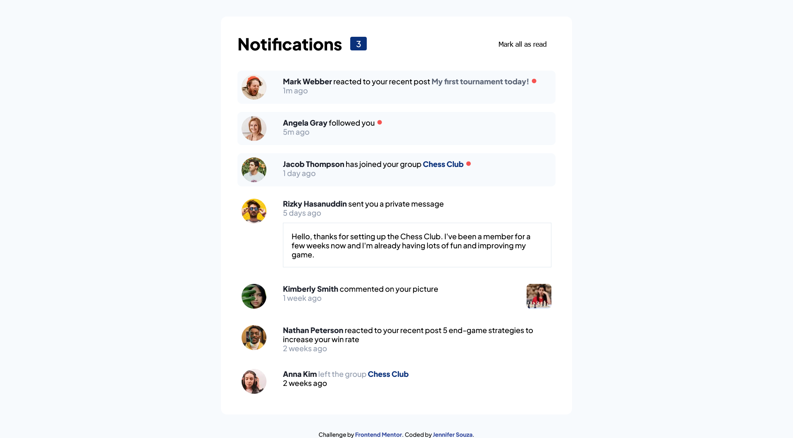

# Frontend Mentor - Notifications page solution

This is a solution to the [Notifications page challenge on Frontend Mentor](https://www.frontendmentor.io/challenges/notifications-page-DqK5QAmKbC). Frontend Mentor challenges help you improve your coding skills by building realistic projects. 

## Table of contents

- [Overview](#overview)
  - [The challenge](#the-challenge)
  - [Screenshot](#screenshot)
  - [Links](#links)
- [My process](#my-process)
  - [Built with](#built-with)
  - [What I learned](#what-i-learned)
  - [Continued development](#continued-development)
  - [Author](#author)

## Overview

### The challenge

Users should be able to:

- Distinguish between "unread" and "read" notifications
- Select "Mark all as read" to toggle the visual state of the unread notifications and set the number of unread messages to zero
- View the optimal layout for the interface depending on their device's screen size
- See hover and focus states for all interactive elements on the page

### Screenshot

### Links

- Solution URL: [https://github.com/zoedarkweather/notifications-page](https://github.com/zoedarkweather/notifications-page)
- Live Site URL: [https://notifications-page-bice-seven.vercel.app/](https://notifications-page-bice-seven.vercel.app/)

## My process

### Built with

- Semantic HTML5 markup
- CSS custom properties
- CSS Grid
- Mobile-first workflow
- JavaScript

### What I learned

This was a mostly a good chance to apply what I've learned in my coursework, and to practice writing CSS. I did learn that I didn't have to specify the bullet unicode character value or HTML code for it - I could just copy it into my css and it works.

### Continued development

Keep practicing with CSS. Keep learning about accessability. I have no vision issues, yet I found it difficult to distinguish between some of the colors on this design, so I can imagine it would be very difficult for someone with vision issues. Also, anyone using a screenreader would maybe know there were unread notifcations, but have no way to tell which were unread as all the indicators are visual. If I felt more confident with Aria labels I think I would have added one to indicate whether a notification is read or unread.

## Author

- Github - [Jennifer Souza](https://github.com/zoedarkweather)
- Frontend Mentor - [@zoedarkweather](https://www.frontendmentor.io/profile/zoedarkweather)
